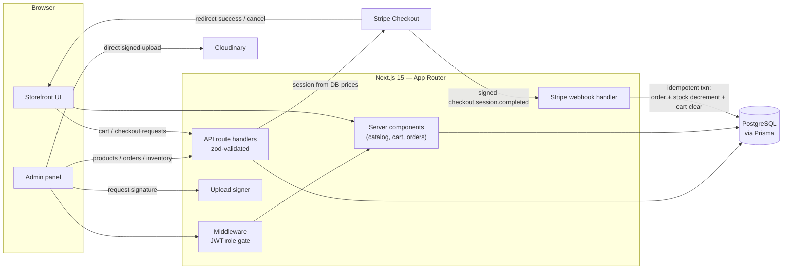
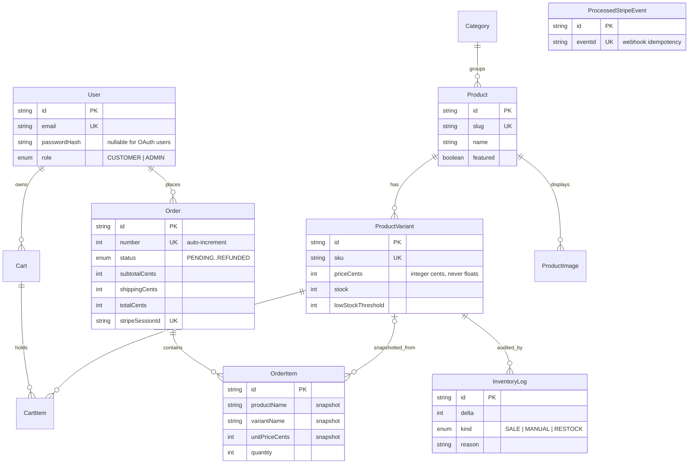

# Atelier — E-Commerce Storefront + Admin Panel

**A full storefront with Stripe checkout, inventory management, and a complete admin panel.**

Atelier is a production-shaped e-commerce application: a polished customer storefront (catalog, search, cart, Stripe Checkout, order tracking) backed by a complete admin panel (dashboard, product CRUD with Cloudinary uploads, inventory with audit trail, order fulfilment, customers). It exists to demonstrate the parts of commerce that are easy to get subtly wrong — money math, webhook idempotency, and overselling under concurrency — implemented the way you would defend them in a design review.


## Features

- **Product catalog** — Products with categories, flattened size/color variants, multiple Cloudinary-backed images and slug URLs. The catalog page combines case-insensitive search, category filtering, price/name/date sorting and pagination, all driven by shareable query-string state (the filter bar is a plain GET form that works without JavaScript).
- **Server-backed cart** — The cart lives in PostgreSQL, keyed by an httpOnly cookie, so it survives reloads and works for guests. Quantity changes are validated against live stock, and the navbar badge updates through a custom DOM event after every mutation.
- **Stripe Checkout + verified webhooks** — Checkout builds line items exclusively from database prices and redirects to a Stripe Checkout Session. The `checkout.session.completed` webhook verifies the signature, then creates the order, decrements inventory and clears the cart inside one idempotent transaction.
- **Inventory management** — Stock is tracked per variant with conditional-update decrements that make overselling impossible under concurrent checkouts. Admins make manual adjustments with a required reason, every movement lands in an `InventoryLog` audit trail, and low-stock variants surface on the dashboard.
- **Order tracking** — Orders move through `PENDING → PAID → FULFILLED → SHIPPED → DELIVERED` (with `CANCELLED`/`REFUNDED` exits) under a state machine that rejects illegal jumps. Customers see a visual status timeline at `/account/orders`; admins advance statuses from the panel with only legal transitions offered.
- **Role-based access + admin panel** — NextAuth (credentials + optional Google OAuth) issues JWT sessions carrying a `CUSTOMER`/`ADMIN` role. Middleware gates `/admin` and `/account`, and every `/api/admin/*` handler re-checks the role server-side. The panel covers dashboard KPIs, product CRUD with signed Cloudinary uploads, inventory, order fulfilment and a customer list with lifetime spend.

## Architecture



Key flows: server components read from PostgreSQL; mutations go through zod-validated route handlers; payment truth flows one way — from Stripe's signed webhook into the database, never from the browser.

## Tech stack

| Technology | Role | Why this choice |
|---|---|---|
| Next.js 15 (App Router) | Full-stack framework | Server components keep prices/stock reads on the server; route handlers and middleware cover the API and auth gating in one deployable |
| TypeScript (strict) | Language | `strict` + `noUncheckedIndexedAccess` catches the bugs commerce code attracts (nullable images, optional variants) |
| PostgreSQL | Database | Real transactions and unique constraints are load-bearing here (idempotency ledger, oversell guard) |
| Prisma | ORM | Typed queries, `$transaction` for atomic webhook processing, and a schema that doubles as documentation |
| Stripe Checkout + webhooks | Payments | Hosted payment page keeps card data out of scope; signed webhooks make payment state tamper-proof |
| NextAuth v4 | Authentication | JWT sessions with role claims; credentials and Google providers behind one API |
| Cloudinary | Image storage/CDN | Signed direct uploads avoid proxying files through the server while keeping the API secret server-side |
| Tailwind CSS | Styling | A constrained utility palette keeps the dark theme consistent across storefront and admin |
| zod | Validation | Every API boundary parses unknown input into typed data or returns a structured 400 |
| Vitest | Unit tests | Fast, pure-logic tests for the money/inventory/status/idempotency invariants — no DB required |

## Getting started

**Prerequisites:** Node.js 20+, Docker (for PostgreSQL), and a [Stripe test-mode account](https://dashboard.stripe.com/test) (free). Cloudinary and Google OAuth are optional.

```bash
# 1. Clone and install (postinstall runs `prisma generate`)
git clone https://github.com/johnrhedatienza/ecommerce-storefront-admin.git
cd ecommerce-storefront-admin
npm install

# 2. Start PostgreSQL
docker compose up -d

# 3. Configure environment
cp .env.example .env
# fill in NEXTAUTH_SECRET (openssl rand -base64 32) and your Stripe test keys

# 4. Create the schema and load the demo catalog
npx prisma migrate dev
npx prisma db seed

# 5. Run
npm run dev
```

To exercise the full payment loop locally, forward webhooks with the Stripe CLI and put the printed `whsec_…` into `STRIPE_WEBHOOK_SECRET`:

```bash
stripe listen --forward-to localhost:3000/api/webhooks/stripe
```

Seeded logins: **admin@atelier.test / admin1234** (admin panel) and **maya@example.com / customer1234** (customer with order history). Test card: `4242 4242 4242 4242`.

## Environment variables

| Name | Required | Description |
|---|---|---|
| `DATABASE_URL` | Yes | PostgreSQL connection string (matches `docker-compose.yml` defaults) |
| `NEXTAUTH_URL` | Yes | Canonical app URL used by NextAuth callbacks |
| `NEXTAUTH_SECRET` | Yes | Secret signing JWT sessions — generate with `openssl rand -base64 32` |
| `NEXT_PUBLIC_APP_URL` | Yes | Base URL for Stripe success/cancel redirects |
| `STRIPE_SECRET_KEY` | Yes | Stripe secret API key (test mode) |
| `STRIPE_WEBHOOK_SECRET` | Yes | Webhook signing secret from `stripe listen` or the dashboard |
| `GOOGLE_CLIENT_ID` | No | Google OAuth client id — the Google button is hidden when unset |
| `GOOGLE_CLIENT_SECRET` | No | Google OAuth client secret |
| `NEXT_PUBLIC_CLOUDINARY_CLOUD_NAME` | No* | Cloudinary cloud name (safe to expose) |
| `CLOUDINARY_API_KEY` | No* | Cloudinary API key sent alongside the server-generated signature |
| `CLOUDINARY_API_SECRET` | No* | Cloudinary API secret — server-only, used to sign uploads |

\* Required only for admin image uploads; the product form falls back to pasting image URLs.

The app **builds and boots with no env vars at all** — configuration is validated at the point of use with descriptive errors, never at import time.

## API reference

| Method | Endpoint | Auth | Description |
|---|---|---|---|
| `GET/POST` | `/api/auth/[...nextauth]` | — | NextAuth sign-in/session endpoints |
| `POST` | `/api/register` | — | Create a customer account (zod-validated, bcrypt-hashed) |
| `GET` | `/api/cart` | Cookie | Current cart with server-computed totals |
| `POST` | `/api/cart` | Cookie | Add a variant to the cart (stock-checked) |
| `PATCH` | `/api/cart/items/:id` | Cookie | Change quantity (`0` removes the line) |
| `DELETE` | `/api/cart/items/:id` | Cookie | Remove a cart line |
| `POST` | `/api/checkout` | Cookie | Create a Stripe Checkout Session from DB prices |
| `POST` | `/api/webhooks/stripe` | Stripe signature | Order creation, inventory decrement, cart clearing |
| `POST` | `/api/admin/products` | Admin | Create a product with variants and images |
| `PATCH` | `/api/admin/products/:id` | Admin | Update product, diff variants, replace images |
| `DELETE` | `/api/admin/products/:id` | Admin | Delete a product (order snapshots survive) |
| `PATCH` | `/api/admin/orders/:id` | Admin | Advance order status (state machine enforced) |
| `POST` | `/api/admin/inventory` | Admin | Manual stock adjustment with audit-log reason |
| `POST` | `/api/uploads/sign` | Admin | Mint a one-time Cloudinary upload signature |

Errors always return `{ "error": { "message", "details?" } }` with a meaningful status (`400` validation, `401`/`403` auth, `404` missing, `409` conflict/stock, `5xx` upstream).

## Database schema



## Implementation highlights

**Never trust client prices.** The checkout endpoint accepts no payload at all — it loads the cart server-side and builds Stripe line items from `variant.priceCents` as stored in PostgreSQL. A tampered request can change nothing about what gets charged, because nothing the client sends participates in pricing:

```ts
const lineItems = cart.items.map((item) => ({
  quantity: item.quantity,
  price_data: {
    currency: "usd",
    unit_amount: item.variant.priceCents, // DB price — never client input
    ...
  },
}));
```

The same principle applies on the way back: orders are only ever created by the webhook handler after `stripe.webhooks.constructEvent` has verified the payload against `STRIPE_WEBHOOK_SECRET`. The success page merely *reads* the order; a user navigating to `/checkout/success` with a forged `session_id` sees nothing they didn't pay for.

**Webhook idempotency as a database constraint.** Stripe retries deliveries until it gets a 2xx, so the same event can arrive twice — or twice *concurrently*. Rather than checking "have I seen this?" (which races), the very first statement of the webhook transaction inserts the event id into `ProcessedStripeEvent`, which has a UNIQUE constraint. A duplicate delivery aborts on `P2002` before any side effects run, and is acknowledged with 200. Because the insert lives inside the same transaction as order creation and stock decrement, a genuine failure rolls *everything* back — including the idempotency record — so Stripe's retry reprocesses a clean slate. Exactly-once semantics, enforced by the database rather than application memory.

**Atomic inventory decrements prevent overselling.** Two shoppers paying for the last unit at the same moment is the classic commerce race. The webhook never does read-then-write; it issues a conditional update per line:

```ts
const result = await tx.productVariant.updateMany({
  where: { id: item.variantId, stock: { gte: item.quantity } },
  data: { stock: { decrement: item.quantity } },
});
if (result.count === 0) throw new Error("oversell guard");
```

The `WHERE stock >= quantity` predicate and the decrement execute as one statement under the database's row lock, so only one of two concurrent transactions can win the last unit — the loser rolls back entirely. The pure decision logic (`planStockDecrements`, which also merges duplicate cart lines so they can't pass the check independently) is unit-tested in isolation, and the manual admin adjustment endpoint reuses the same conditional-update pattern so stock can never go negative from any code path.

**Money is integer cents, end to end.** Floats cannot represent most decimal fractions (`0.1 + 0.2 !== 0.3`), and once subtotals, discounts and processor totals each round differently, reconciliation breaks. Every amount in the schema is an `Int` of cents (`priceCents`, `totalCents`), all arithmetic in `src/lib/money.ts` operates on integers (with an `assertCents` guard that rejects floats outright), and the only float ever produced is in `formatCents` for display. This also matches Stripe's own contract — `unit_amount` is integer cents — so no conversion layer exists to drift. `OrderItem` additionally snapshots `productName`, `variantName` and `unitPriceCents` at purchase time: orders are historical documents, and an admin repricing a product next quarter must not rewrite what customers already paid (deleted variants set `variantId` to NULL while the snapshot survives).

**Cloudinary signed uploads keep the secret server-side.** Product images upload from the admin's browser straight to Cloudinary — the file never transits this server — but Cloudinary only accepts the upload because it carries a SHA-1 signature over the exact parameter set and timestamp, minted by `/api/uploads/sign` for authenticated admins only. The `CLOUDINARY_API_SECRET` never reaches the client; shipping it in browser code would let anyone upload arbitrary content into the media library (and signed URLs expire, so leaked signatures don't help either). The delivery URL is stored on `ProductImage` at upload time, so rendering the catalog requires no credentials at all.

**Offline-buildable by design.** `npm run build` and `npm test` succeed with no database, no Stripe keys and no `.env`: every page touching data declares `export const dynamic = "force-dynamic"`, Prisma/Stripe clients are lazy singletons constructed on first request, and env validation happens at point of use with errors that say exactly which variable is missing.

## Project structure

```
.
├── docker-compose.yml        # local PostgreSQL
├── prisma/
│   ├── schema.prisma         # data model (money as integer cents)
│   └── seed.ts               # demo catalog, users, orders
├── src/
│   ├── app/                  # App Router: (store)/, admin/, api/
│   ├── components/           # site/, products/, cart/, auth/, admin/, ui/
│   ├── lib/                  # money, inventory, orders, stripe, cart, validators…
│   ├── types/                # next-auth session augmentation
│   └── middleware.ts         # /admin + /account gating
└── tests/                    # Vitest unit tests (pure logic, no DB)
```

## Testing

Unit tests cover the four invariants the business logic depends on — all pure functions, no database or network, finishing in well under a second:

- **`cart-totals.test.ts`** — line/subtotal/discount/shipping math in integer cents, including float rejection and the 100%-discount edge
- **`oversell-guard.test.ts`** — stock planning, duplicate-line merging, exact-remaining-stock purchases, negative-stock protection
- **`order-status.test.ts`** — the full transition matrix: happy path, no skips, no backward moves, terminal states
- **`webhook-idempotency.test.ts`** — event-id validation and replayed-delivery detection

```bash
npm test          # vitest run
npm run test:watch
```

## Roadmap

- Discount codes at checkout (the cart math already models percent/fixed discounts)
- Stripe refunds triggered from the admin panel, synced via `charge.refunded` webhooks
- Transactional email (order confirmation, shipping updates) via Resend
- Postgres full-text search with `pg_trgm` to replace `ILIKE` catalog search
- Rate limiting on auth and checkout endpoints
- Playwright end-to-end suite covering the checkout loop against a Stripe test clock

## License

MIT © 2026 John Rhed Atienza — see [LICENSE](LICENSE).
